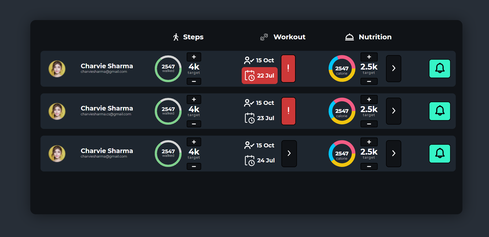
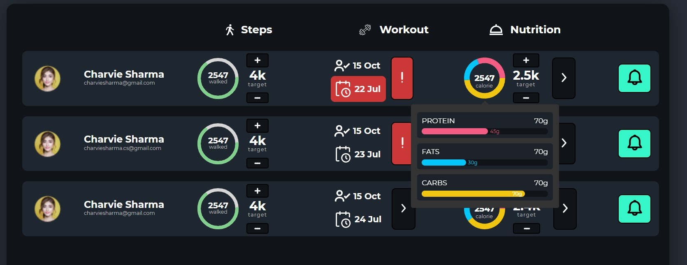
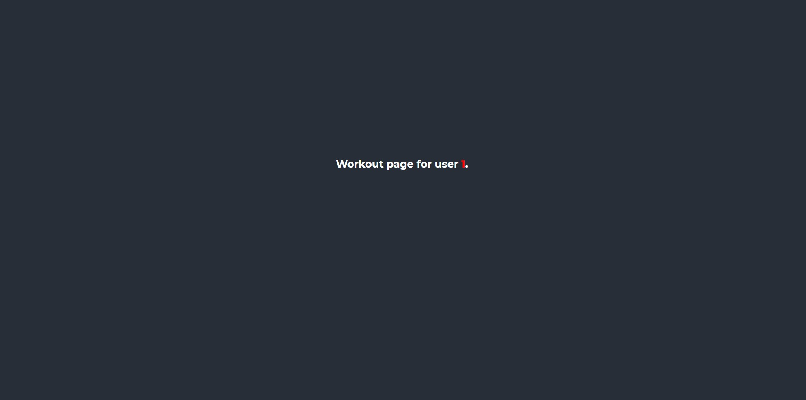
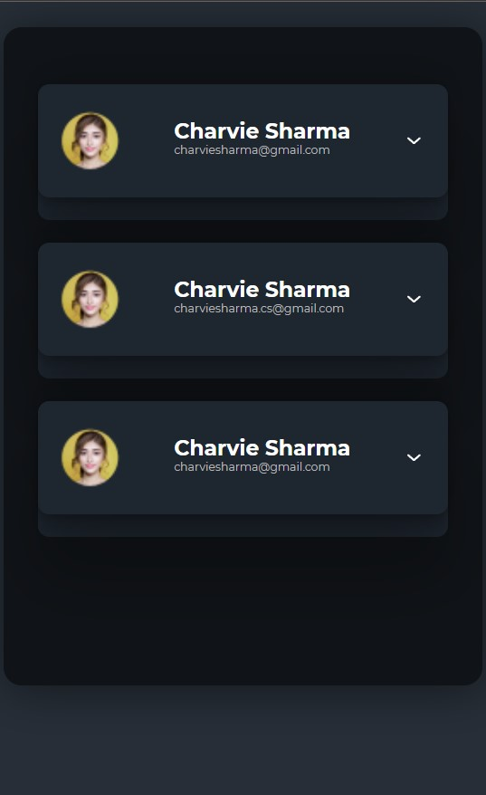
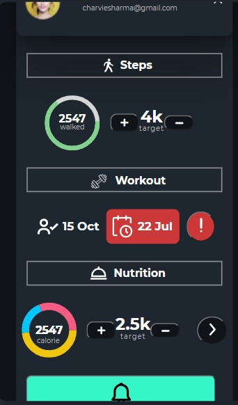

# Trainer Dashboard



## Demo
 [link](https://evolv-frontend-challenge.vercel.app/)

## Built With
- [ReactJS](https://reactjs.org/)
- [Circular Progress Bar](https://www.npmjs.com/package/react-circular-progressbar)
- [Minimal Pie Chart](https://www.npmjs.com/package/react-minimal-pie-chart)
- [TippyJS](https://atomiks.github.io/tippyjs/)


## Setup
Download [Node.js](https://nodejs.org/en/download/).
Run this followed commands:

``` bash
# Install dependencies (only the first time)
npm install

# Run the local server at localhost:8080
npm run dev

# Build for production in the dist/ directory
npm run build
```
## Note
```
 All challenge levels are completed and can be verified.
 ```

## Model

Main Dashboard:


<br/>
Extra Page:

<br/>
Responsive showcase:

<br/>



